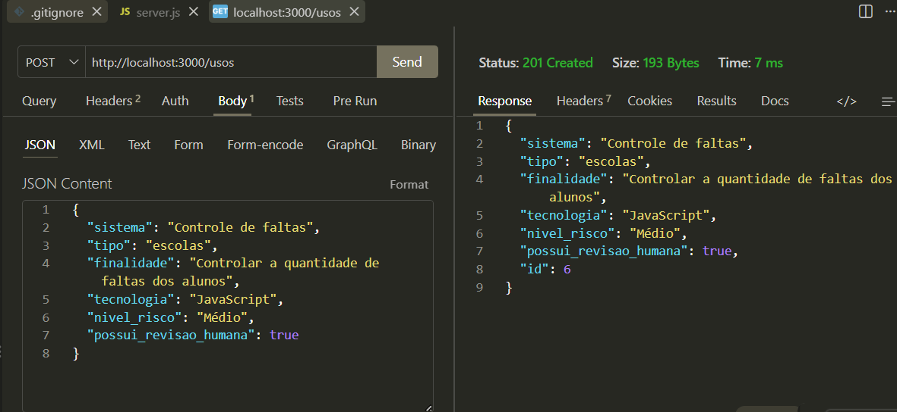
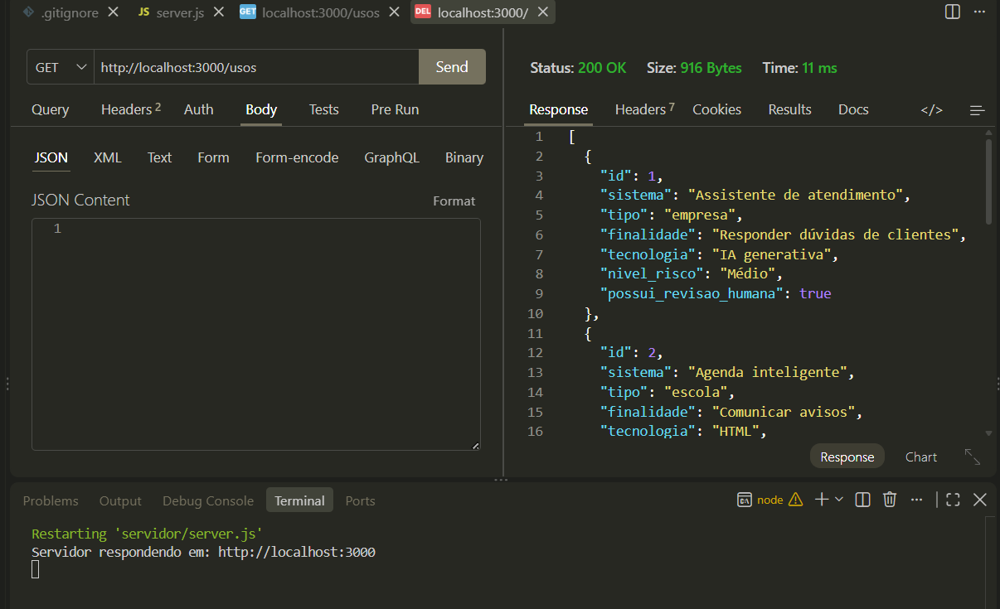
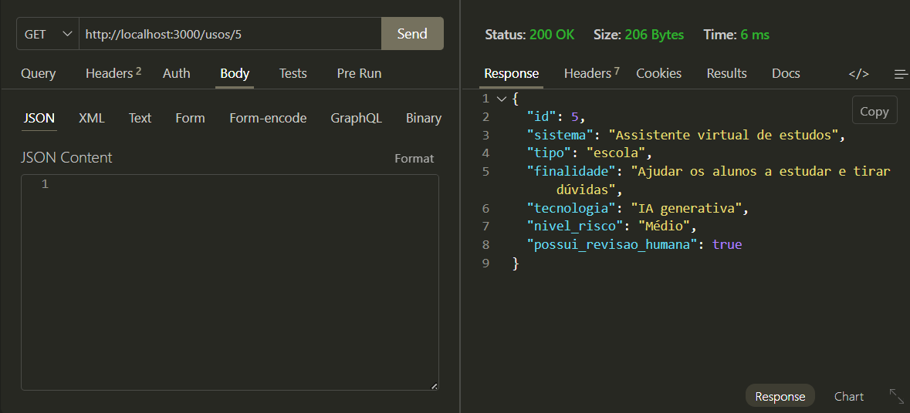
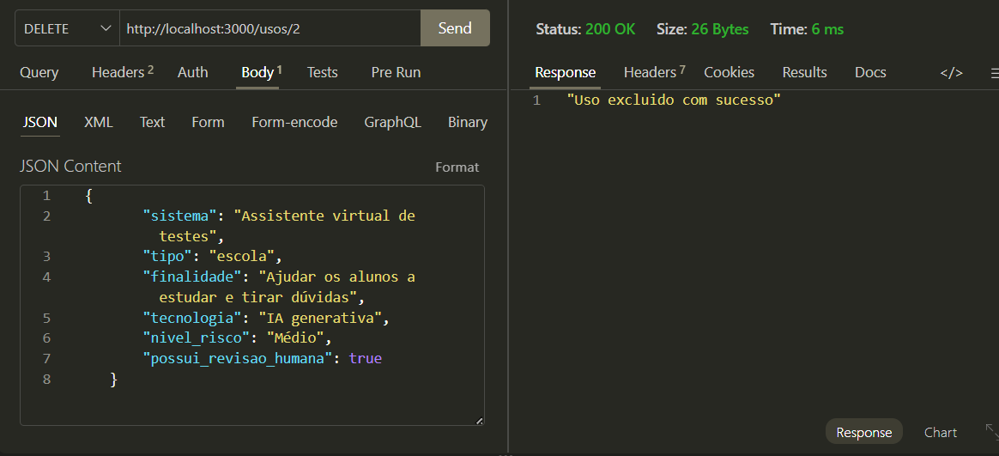
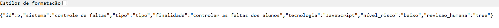
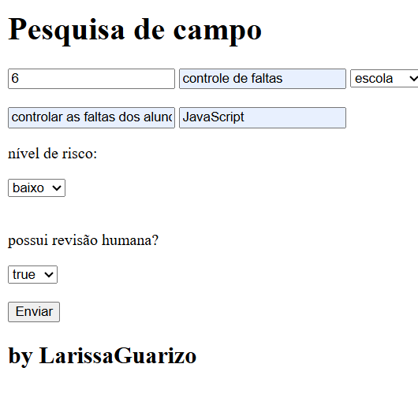

# Pesquisa de campo Back-End
## Tecnologias
- Node.js
- JavaScript
- VsCode
- VsCode Thunder Client

## Passos para testar
- 1 Clone este repositório
- 2 Abra com VsCode e em um terminal digite:
``
npm install
npm run dev
``
- 3 Teste as rotas com a extensão Thunder Client do VsCode
- 4 Abra o arquivo client/index.html com a extensão Live Server do VsCode

## Print dos testes e exemplo de requisições
- CREATE

- READ ALL

- BUSCAR

- UPDATE

- DELETE

### Cliente

- Resposta
